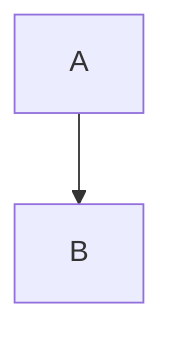

# Hello — Markdown preview

اردو: یہ ایک دستاویز ہے۔
سنڌي: سلام دنيا
العربية: مرحبا بالعالم
中文：你好世界

| Name | Value |
| --- | --- |
| Code | 001 |
| Unicode | سنڌي |

- [x] Completed task
- [ ] Pending task

> A quotation with **bold** text.

$$
x^2 + y^2 = z^2
$$

[Unsafe link](javascript:alert)
[Local file](file:///C:/private.txt)
